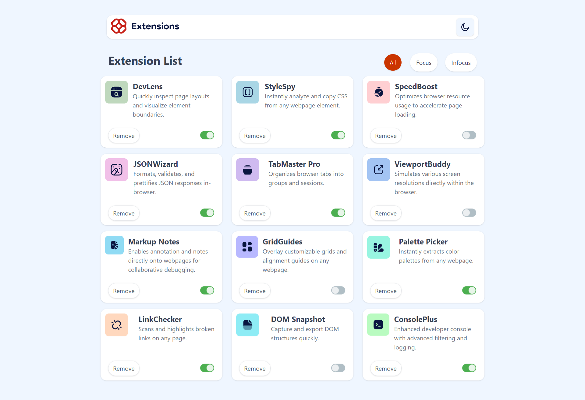

# 📦 Extension List App

Este projeto é uma aplicação Angular standalone que exibe uma lista de extensões com opção de filtro (`All`, `Focus`, `Infocus`) e suporte a **modo escuro**. O layout é construído com **Tailwind CSS 4.1**, sendo totalmente responsivo e com foco em performance mobile.

## ✨ Funcionalidades

- ✅ Lista de extensões com imagem, nome e descrição
- 🎯 Filtro por status: todas, ativas (`focus`) e inativas (`infocus`)
- 🌗 Suporte a tema claro/escuro com `toggle`
- ❌ Botão para remover item da lista
- 📱 Interface responsiva e com efeitos suaves
- ⚡️ Implementado apenas com Angular + Tailwind (sem dependências externas)

## 📸 Preview

| Tema Claro | Tema Escuro |
|------------|-------------|
|  |  |

## 🚀 Como rodar localmente

### 1. Pré-requisitos

- Node.js 18+
- Angular CLI 15+
- Tailwind CSS 4.1

### 2. Instalação

```bash
npm install
